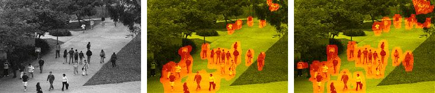
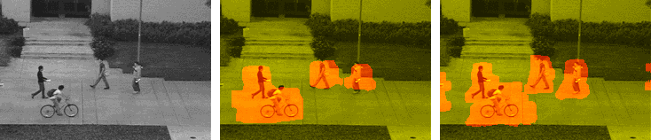

# If this repository helps you in anyway, show your love heart by putting a star :star: on this project 
# MotionDetector

#######################################################
#######################################################

    3D-DWT Motion Detector  
    
    Developed by: Sahar Yousefi

 
#######################################################
#######################################################

for more information :     <a href="https://ieeexplore.ieee.org/abstract/document/8561242/">A Novel Motion Detection Method Using 3D Discrete Wavelet Transform</a> 

Team: Sahar Yousefi, M.T. Manzuri Shalmani, Jeremy Lin, Marius Staring

## Run:
    main.m
    
## Flow diagram 

Flow diagram of the proposed method. The input is a sequence of video frames; Step 1: Extracting the cubic patches; Step 2: Applying the 3D-DWT on each patch for computing wavelet coefficients, and wavelet leaders. The seven green patches are the wavelet coefficients extracted from the original patch, the yellow patch is the wavelet leader of 3rd scale, the seven blue patches are the wavelet coefficients extracted from W3_{LLL}, the orange patch is the wavelet leader of 2nd scale, the eight cubic red patches are the wavelet coefficients extracted from W2_{LLL}, and the purple patch is the wavelet leader of 1 st patch. Step 3: Computing the feature descriptors using the wavelet coefficients and the wavelet leaders, here the value of features for all the wavelet coefficients and the wavelet leaders are shown. The green arrows depict the feature descriptor values for the moving objects in the video sequences. As can be seen, the feature descriptors F_{LHH}, F_{HLH}, F_{LLH}, Fleader can model the motion pattern obviously; Step 4: Applying K-means classification. Finally, the result of the classifier which illustrate moving objects (red regions) and static regions (green regions).

## Results

Left to right: original video, MDT, proposed method

Left to right: original video, MDT, proposed method

Quantitative comparision between the proposed method and the other methods

## Licence
You are welcome to use this code in your own work. If you use this code, please cite the below paper:

<a href="https://ieeexplore.ieee.org/abstract/document/8561242/">A Novel Motion Detection Method Using 3D Discrete Wavelet Transform</a>

## Acknowledgments

We acknowledge S. Cai, K. Li, and I. Selesnick for the Wavelet Transforms package. 

