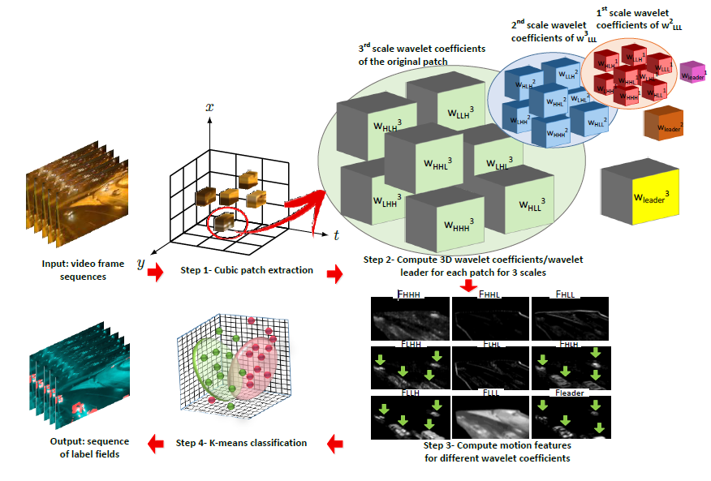
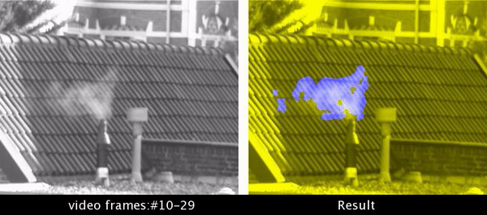

# MotionDetector

#######################################################
#######################################################

    3D-DWT Motion Detector  
    
    Developed by: Sahar Yousefi
 
 
#######################################################
#######################################################

for more information : http://dspl.ce.sharif.edu/motiondetector.html

Team: Sahar Yousefi, M.T. Manzuri Shalmani, Jeremy Lin, Marius Staring

## Team Members

Sahar Yousefi

Run:
    main.m
    
## Flow diagram 

## Results

## Acknowledgments

Thanks to S. Cai et al.[1] for their Wavelet Transforms package. 

1. S. Cai, K. Li, and I. Selesnick. Matlab Implementation of Wavelet Transforms. Retrieved from http://eeweb.poly.edu/iselesni/WaveletSoftware on February 13, 2018.
